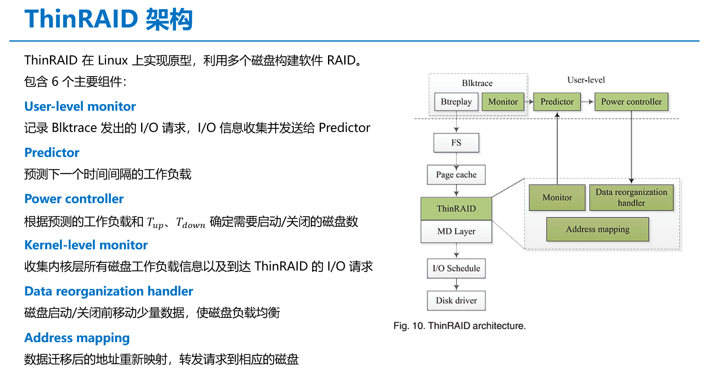

<!--
 * @Author: Chen Shi
 * @Date: 2023-11-23 11:19:11
 * @Description: 
-->
## 需要实现的模块

## 知识点小记

### LS 和 LA

* 对称
  
  将每个 stripe 中的第一个数据放在校验和的后面，然后再往后排列，需要时再绕回第一个磁盘往后放；这种对称的数据排列方式就能始终按照磁盘的顺序依次下来。

* 不对称
  
  将数据从左到右，按顺序直接排下来存储（图中的左不对称和右不对称的前后数据不对称）

1. 由于实际读写 Raid5 时命令时均匀发到每个磁盘上的，
因此 “对称” 方式在处理大块值的连续 I/O 读时有更好的性能，实际测试中对随机 I/O 性能也有提升；

2. Left-symmetric 作为 Raid5 默认的分布算法，也是对于读请求性能最佳的数据分布机制；

3. 数据分布机制带来的性能差异，相对于 Raid5 中的磁盘个数以及 stripe 条带大小参数来说是比较细微的。