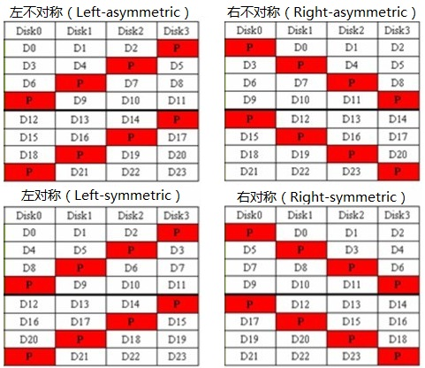

<!--
 * @Author: Chen Shi
 * @Date: 2024-01-16 15:22:06
 * @Description: 
-->
## RaidSim-thinraid 复现项目

通过 Python 实现一个粗略的 RAID 模拟器并实现固定条带扩展、数据迁移算法以及功耗控制策略。

### 实现思路

### 各个模块介绍

### UML 图

### 实验测试

需要统计的性能指标：

* 功耗控制策略准确度
* 休眠时长对比
* 磁盘 I/O 次数对比
* 休眠次数

#### 功耗控制策略准确度

| 图类型 | 说明 |
|:--------: | :---------:|
| 折线图（分 4 张图） | 每个 trace 的 thinraid 模式中得到的 Groundtruth 和 Result 进行对比 |

#### 休眠时长对比

| 图类型 | 说明 |
|:--------: | :---------:|
| 柱状图 | hm、mds、prn、proj 4 类 trace 作为 base，每类 trace 包括 3 种模式的休眠总时长 |

#### 空闲时长对比

| 图类型 | 说明 |
|:--------: | :---------:|
| 柱状图 | hm、mds、prn、proj 4 类 trace 作为 base，每类 trace 包括 3 种模式的空闲总时长 |

#### 磁盘 I/O 总次数对比

| 图类型 | 说明 |
|:--------: | :---------:|
| 柱状图 | hm、mds、prn、proj 4 类 trace 作为 base，每类 trace 包括 3 种模式的磁盘 I/O 总次数 |

#### 按时间间隔顺序不同模式下的磁盘启用数

| 图类型 | 说明 |
|:--------: | :---------:|
| 折线图（分 4 张图） | hm、mds、prn、proj 4 类 trace 各一张图，每张图包括 3 种模式按时间间隔的磁盘启用数 |

#### 按时间间隔顺序不同模式下的磁盘活跃数

| 图类型 | 说明 |
|:--------: | :---------:|
| 折线图（分 4 张图） | hm、mds、prn、proj 4 类 trace 各一张图，每张图包括 3 种模式按时间间隔的磁盘活跃数 |

#### 实际执行时间对比

| 图类型 | 说明 |
|:--------: | :---------:|
| 柱状图 | hm、mds、prn、proj 4 类 trace 作为 base，每类 trace 包括 3 种模式的实际执行时间对比 |

---

## 知识点记录

### LS 和 LA

* 对称：  
  将每个 stripe 中的第一个数据放在校验和的后面，然后再往后排列，需要时再绕回第一个磁盘往后放；这种对称的数据排列方式就能始终按照磁盘的顺序依次下来。

* 不对称：  
  将数据从左到右，按顺序直接排下来存储（图中的左不对称和右不对称的前后数据不对称）

简单总结：
1. 由于实际读写 Raid5 时命令时均匀发到每个磁盘上的，因此对称方式在处理大块值的连续 I/O 读时有更好的性能，实际测试中对随机 I/O 性能也有提升；
2. Left-symmetric 作为 Raid5 默认的分布算法，也是对于读请求性能最佳的数据分布机制；
3. 数据分布机制带来的性能差异，相对于 Raid5 中的磁盘个数以及 stripe 条带大小参数来说是比较细微的。

---

## 解决问题日志

24.01.18 前都没有记载了。

### 24.01.18

* ~~req_interval 读取的时候会间隔一个读取，少读取一些 reqs~~
* ~~磁盘之间负载不均衡，占用率低但反而 IO 次数高~~
* ~~enabled 的经过时间大于 disabled 的经过时间~~

### 24.01.21

* ~~磁盘之间负载不均衡，占用率低但反而 IO 次数高~~
* ~~enabled 的经过时间大于 disabled 的经过时间~~
* ~~打印输出 block table~~
* ~~打印输出 hots~~
* ~~同一条带的待迁移数据块不能随机放在新添加磁盘上~~
* （❌）req_requests 为 0 的时候的过滤
* ~~es 数据迁移算法的验证~~

### 24.01.29

* ~~添加磁盘休眠时间~~
* ~~trace 内请求磁盘号修改~~
* ~~trace 内偏移地址按比例放缩（ 10000 * 原偏移地址 / 最大偏移地址，并保证处理后地址小于 10000，不会超过范围）~~
* ~~IOCollector 传入 Config 实例~~

### 24.02.10

* ~~添加无迁移算法、无功耗控制策略模式~~
* ~~测试其他 trace~~
* 解决 bug

### 24.03.03

* ~~修改 trace 请求磁盘号为最大磁盘数，当以小规模建立 raid 时将磁盘号 mod 以避免越界~~
* ~~修改 miu 的值，更改为：已处理请求数 / 已经过单位时间~~
* ~~测试其他 trace~~
* ~~解决 bug~~
* ~~修改，所有启用和未启用磁盘的休眠时长统计从开始到结束整个周期~~

### 24.04.11

* ~~将原先直接对磁盘号请求修改为对 RAID 整体逻辑磁盘请求~~

### 24.04.15

* 添加 Wall Time 计时，Predictor 中传入实际时间以参与预测

* 代码重构