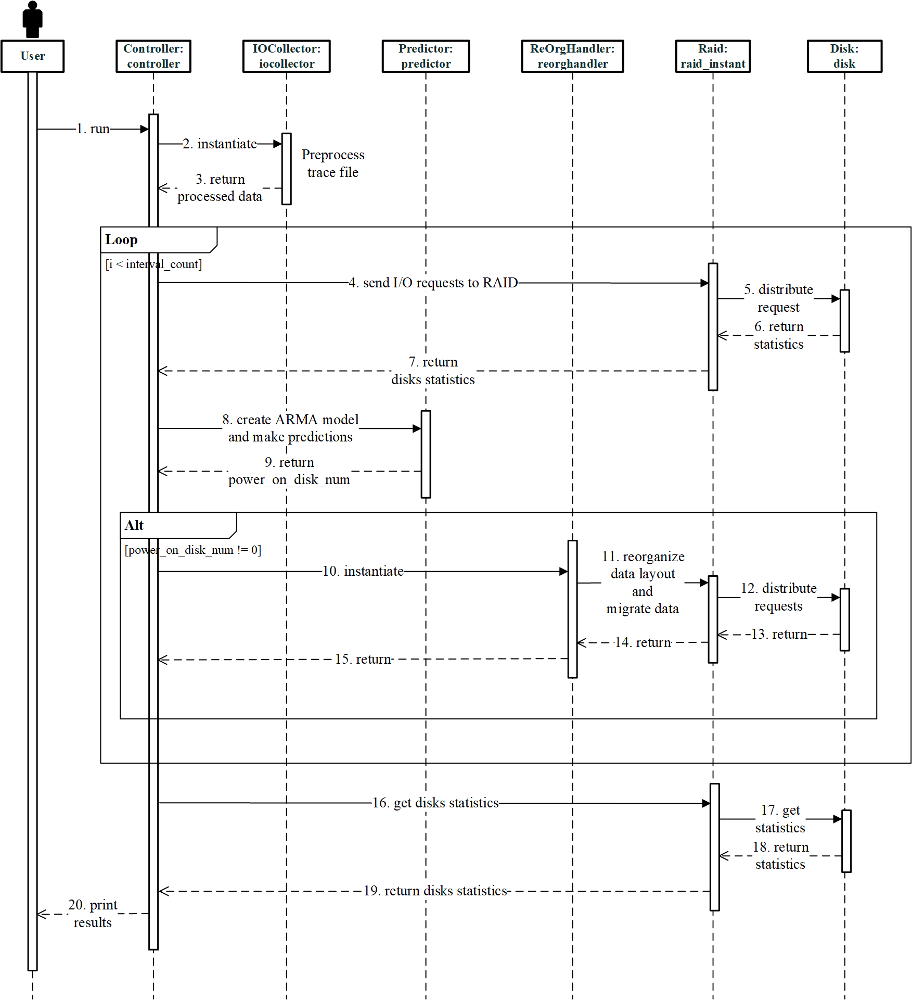

<!--
 * () @Author: Chen Shi
 * () @Date: 2024-01-16 15:22:06
 * () @Description: README of this project
-->

## RaidSim-ThinRAID Project

通过 Python 实现一个粗略的 RAID 模拟器并实现固定条带扩展、数据迁移算法以及功耗控制策略。写的很粗略，算是一个小练手叭。

### 实现思路

本 RAID 磁盘阵列模拟器主要包括 Block 类、Disk 类、RAID 类、Config 类、IOReq 类、IOCollector 类、Predictor 类、ReOrgHandler 类、Controller 类等，每个类用于模拟 RAID 磁盘阵列的一部分，最后由 Controller 类整合到一起，模拟完整的基于数据迁移的绿色节能解决方案。该 RAID 模拟器的思路是是以每个 I/O 请求进行循环，循环前通过 IOCollector 实例获得工作负载 trace 文件的预处理数据，每个循环中执行分发读取写入请求，RAID 实例将请求分发到各个磁盘并记录数据块热度值，并判断时间戳是否达到时间间隔，当达到时间间隔时，控制器记录相关数据，建立模型预测下一时间间隔工作负载、执行功耗控制策略、根据策略执行数据迁移算法等一系列操作，循环结束后获得每个磁盘的统计数据并打印。

---

### 各个模块介绍

#### Block

The Block class simulates a single data block on the disk, 
including data flag bit, hot value of this block, modification flag bit, remapping flag bit, 
current disk number and offset address on the disk, remapped disk number and offset address and so on. 
The main function of the Block class is to simulate data blocks on the disk, 
which is used for each data reading and writing of the disk. 
Besides, when data migration of the disk occurs, data are migrated in the unit of Block. 

#### Disk

The Disk class simulates a single disk, 
including the magnetic head position, 
the number of tracks, 
the number of blocks on each track, 
the active flag of disk, the number of disk reads and writes, 
duration of sleep, active and idle time, and time points statistics and so on, 
as well as a series of operations such as reading and writing, spinning up and spinning down, etc. 
The main function of the Disk class is to simulate a single disk in a RAID and its various operations. 
When implementing the power saving solution based on data migration, 
it simulates the spinning up and spinning down of each disk, the data migration between disks, 
and records the disks information such as I/O information, 
active, idle and sleep duration and time points of them for the following experiments and comparision.

#### RAID

The RAID class simulates a RAID 5 level disk array, 
which includes the current number of active disks, 
the minimum and maximum number of disks, block size, request size, 
and Block Table that records block information and remapping relationships and so on, 
as well as a series of operations such as disk initialization, 
Block Table initialization, parity blocks update, read and write requests distribution, 
read and write by stripe, adding, deleting and ending disks, disk information statistics and so on. 
The main function of the RAID class is to simulate the structure and function of a RAID 5 level disk array, 
and implement a series of operations of the power saving solution based on data migration 
to explore the feasibility. 

#### Config

The Config class is used to read various parameters of the RAID and data migration algorithm configured in the config.yaml file, 
including parameters such as the number of disks, block size, request size, number of blocks on each disk, 
and the trace file, workload time interval, disk sleep timeout, prediction model upper and lower bound thresholds, 
and whether to enable the data migration algorithm. 
They are saved in a Config instance and the instance is passed to each module for parameter reading.

#### IOReq

The IOReq class is used to record each request in each workload trace. 
The recorded information includes the timestamp of each request, 
the requested disk number, 
read or write, 
offset address, and request size. 
After reading the workload trace, each request is recorded in a IOReq instance. 
When other modules need to access the I/O information of the workload, 
they access it through the IOReq instance and perform the next step.

#### IOCollector

The IOCollector class is used to read the workload trace and obtain I/O requests, 
and provides getting data interfaces for other modules to invoke, 
including a list of IOReq instances, a list of prediction data, etc., 
as well as operations such as processing the raw trace file, 
reading the I/O information of the workload trace, 
processing the trace file and obtaining prediction data and so on. 
The main function of the IOCollector class is to preprocess workload trace file and 
provide interfaces to facilitate other modules to obtain these processed data.

#### Predictor

The Predictor class is used to predict the workload of the next time interval. 
Through the predicted request arrival rate and the calculated request service rate, 
the number of disks to be spun up in the next time interval is calculated. 
The Predictor class includes data from IOCollector, time interval, current number of active disks, 
minimum and maximum number of disks, 
upper and lower bound thresholds, step of spinning up and down disks, etc., 
as well as operations such as establishing an ARIMA prediction model, 
calculating the number of disks to be spun up in the next time interval based on the M/M/1 theory. 
The main function of the Predictor class is to implement the power control policy in the solution of this thesis, 
which is to predict the next workload intensity and obtain the number of disks to be spun up 
based on the workload of several recent time intervals.

 

#### ReOrgHandler

The ReOrgHandler class is used to migrate and reorganize blocks on the disks, 
which includes the number of disks to be spun up from the Predictor, 
the number of currently active disks, 
the Block Table from the RAID instance, the workload time interval, 
the popularity of blocks, the list of blocks to be migrated, etc., 
as well as a series of operations such as setting the popularity of blocks, 
calculating the migration threshold, 
and implementing the data migration algorithm when adding and deleting disks. 
The main function of the ReOrgHandler class is to implement the data migration algorithm, 
and spin up and down disks, and perform data migration between disks according to the idea of the data migration algorithm.

#### Controller

The Controller class is used to integrate the above modules, 
it is a controller of the RAID, which includes I/O statistics, RAID information, etc., 
as well as operations such as distributing read and write requests. 
The Controller class implements the power saving solution 
based on data migration in this thesis by integrating the instances of each module. 
It loops by each I/O request. 
Before looping, it obtains preprocessed data through the IOCollector. 
During the loop, it sends each request to the RAID instance, 
tells if the timestamp reaches the time interval, 
when reaching the interval, the controller records relevant information, 
establishes a model to predict the workload in the next time interval, 
executes the power control policy, 
executes the data migration algorithm according to the policy, and other operations.  
After the loop ends, the statistics of each disk is obtained and printed to the result file.

### UML 图

#### 类图

#### 时序图

---

### 实验测试

需要统计的性能指标：

* (✔) 功耗控制策略准确度
* (✔) 休眠时长对比
* (✔) 空闲时长对比
* (✔) 磁盘 I/O 次数对比
* (✔) 休眠次数

#### 功耗控制策略准确度

| 图类型 | 说明 |
|:--------: | :---------:|
| 折线图（分 4 张图） | 每个 trace 的 thinraid 模式中得到的 Groundtruth 和 Result 进行对比 |

#### 休眠时长对比

| 图类型 | 说明 |
|:--------: | :---------:|
| 柱状图 | hm、mds、prn、proj 4 类 trace 作为 base，每类 trace 包括 3 种模式的休眠总时长 |

#### 空闲时长对比

| 图类型 | 说明 |
|:--------: | :---------:|
| 柱状图 | hm、mds、prn、proj 4 类 trace 作为 base，每类 trace 包括 3 种模式的空闲总时长 |

#### 磁盘 I/O 总次数对比

| 图类型 | 说明 |
|:--------: | :---------:|
| 柱状图 | hm、mds、prn、proj 4 类 trace 作为 base，每类 trace 包括 3 种模式的磁盘 I/O 总次数 |

#### 按时间间隔顺序不同模式下的磁盘启用数

| 图类型 | 说明 |
|:--------: | :---------:|
| 折线图（分 4 张图） | hm、mds、prn、proj 4 类 trace 各一张图，每张图包括 3 种模式按时间间隔的磁盘启用数 |

#### 按时间间隔顺序不同模式下的磁盘活跃数

| 图类型 | 说明 |
|:--------: | :---------:|
| 折线图（分 4 张图） | hm、mds、prn、proj 4 类 trace 各一张图，每张图包括 3 种模式按时间间隔的磁盘活跃数 |

#### 实际执行时间对比

| 图类型 | 说明 |
|:--------: | :---------:|
| 柱状图 | hm、mds、prn、proj 4 类 trace 作为 base，每类 trace 包括 3 种模式的实际执行时间对比 |

---

## 知识点记录

### LS 和 LA

* 对称：  
  将每个 stripe 中的第一个数据放在校验和的后面，然后再往后排列，需要时再绕回第一个磁盘往后放；这种对称的数据排列方式就能始终按照磁盘的顺序依次下来。

* 不对称：  
  将数据从左到右，按顺序直接排下来存储（图中的左不对称和右不对称的前后数据不对称）

简单总结：
1. 由于实际读写 Raid5 时命令时均匀发到每个磁盘上的，因此对称方式在处理大块值的连续 I/O 读时有更好的性能，实际测试中对随机 I/O 性能也有提升；
2. Left-symmetric 作为 Raid5 默认的分布算法，也是对于读请求性能最佳的数据分布机制；
3. 数据分布机制带来的性能差异，相对于 Raid5 中的磁盘个数以及 stripe 条带大小参数来说是比较细微的。

---

## 解决问题日志

24.01.18 前都没有记载了。

### 24.01.18

* (✔) req_interval 读取的时候会间隔一个读取，少读取一些 reqs
* (✔) 磁盘之间负载不均衡，占用率低但反而 IO 次数高
* (✔) enabled 的经过时间大于 disabled 的经过时间

### 24.01.21

* (✔) 磁盘之间负载不均衡，占用率低但反而 IO 次数高
* (✔) enabled 的经过时间大于 disabled 的经过时间
* ~~(✔) 打印输出 block table~~
* ~~(✔) 打印输出 hots~~
* (✔) 同一条带的待迁移数据块不能随机放在新添加磁盘上
* (❌) req_requests 为 0 的时候的过滤
* (✔) es 数据迁移算法的验证

### 24.01.29

* (✔) 添加磁盘休眠时间
* (✔) trace 内请求磁盘号修改
* (✔) trace 内偏移地址按比例放缩（ 10000 * () 原偏移地址 / 最大偏移地址，并保证处理后地址小于 10000，不会超过范围）
* (✔) IOCollector 传入 Config 实例

### 24.02.10

* (✔) 添加无迁移算法模式
* (❌) 添加无功耗控制策略模式
* (✔) 测试其他 trace
* (✔) 解决 bugs

### 24.03.03

* (✔) 修改 trace 请求磁盘号为最大磁盘数，当以小规模建立 raid 时将磁盘号 mod 以避免越界
* (✔) 修改 miu 的值，更改为：已处理请求数 / 已经过单位时间
* (✔) 测试其他 trace
* (✔) 解决 bug
* (✔) 修改，所有启用和未启用磁盘的休眠时长统计从开始到结束整个周期

### 24.04.11

* (✔) 将原先直接对磁盘号请求修改为对 RAID 整体逻辑磁盘请求

### 24.04.15

* (✔) 添加 Wall Time 计时，Predictor 中传入实际时间以参与预测
* (✔) 代码重构